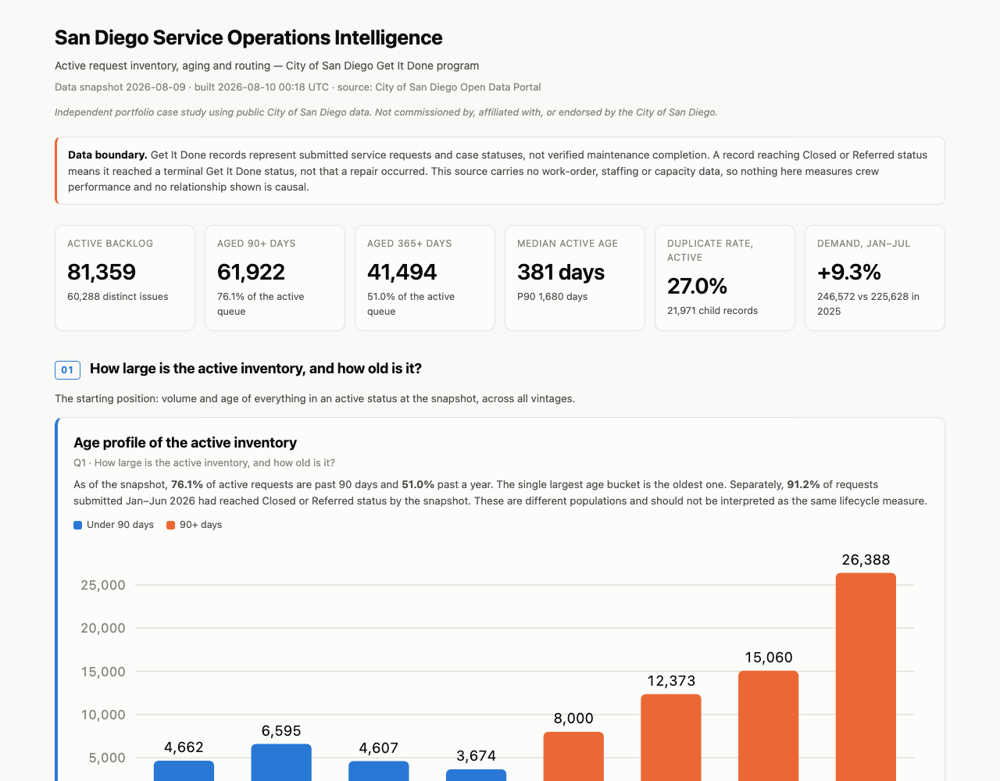

# San Diego Service Operations Intelligence

### Alan Ibarra — Data & Operations Analyst

**San Diego received 389,940 Get It Done submissions in 2025. At the Aug. 9, 2026
snapshot, 81,359 requests were active; 51.0% had been open for more than a year. Where
should leadership investigate first?**

An end-to-end analyst case study on **714,925 real service requests** from the City of San
Diego's Get It Done program: source retrieval → data quality audit → SQL analysis →
executive dashboard → Excel workbook → one-page decision memo.

`SQL / DuckDB` · `Python / pandas` · `Excel` · `Dashboarding` · `Data Quality` ·
`KPI Definition` · `Cohort Analysis` · `Business Analysis` · `Executive Communication` ·
`Git / CI`

> **Independent portfolio case study** using public City of San Diego data. Not commissioned
> by, affiliated with, or endorsed by the City of San Diego. The stakeholder is hypothetical.

**[▶ Executive dashboard](05_dashboard/dashboard.html)** · **[Executive
memo](06_executive_memo/executive_memo.md)** · **[SQL](03_sql/)** · **[Excel
workbook](05_dashboard/san_diego_ops_review.xlsx)** · **[Data quality
audit](02_data_audit/data_quality_report.md)** · **[Full findings](04_analysis/findings.md)**



---

## What I found

Real data: [City of San Diego Open Data Portal — Get It
Done](https://data.sandiego.gov/datasets/get-it-done-reports/), 714,925 case records,
snapshot 2026-08-09. Every figure below is recomputed from the generated data by
[`scripts/verify_claims.py`](scripts/verify_claims.py) and fails the build if it drifts.

**1 — Recent-cohort status and active-inventory age are different measures.**
Of requests submitted Jan–Jun 2026, **91.2%** had reached Closed or Referred status by the
snapshot; among those terminal-status records, median recorded lifecycle was **2** days.
Separately, the standing active inventory contained **81,359** requests — **60,288**
distinct issues once duplicates collapse — with a median age of **381** days. These are
different populations and should not be interpreted as the same lifecycle measure.

**2 — Three quarters of the active inventory is past 90 days.**
**61,922** records (**76.1%**) exceed 90 days; **51.0%** exceed a year, and the P90 is
**1,680** days. The largest age bucket is the oldest one.

**3 — Four categories hold half the workload.**
Sidewalk Repair Issue (**14,614** active, median **1,090** days), Street Light Maintenance,
ROW Maintenance and Pavement Maintenance (median **1,295.5** days) together are **54.2%** of
active records. Sidewalk and Pavement alone hold **30.9%** of the citywide 90+ day inventory.
**TSW** is the modal `case_record_type` for all four — **64.0%** of active records carry it,
though `case_record_type` is a higher-level staff-group label, not a current ownership field.

**4 — A quarter of the active queue is duplicate reports.**
**21,971** records (**27.0%**) duplicate an already-open request. Street Light Maintenance
carries **6,189** of them — **45.3%** of its own queue. Collapsing duplicates moves top-20
volume rankings by no more than **2** positions.

**5 — Two headline metrics are traps. I caught both.**
The **3**-day median recorded lifecycle for records closed this year is a cohort artifact —
**88.1%** of those records were also submitted this year, so slower records are absent by
construction. And submission channel looks influential until you stratify by service
category, after which the median Mobile-vs-Web difference is **2** days.

**6 — Two patterns are *not* in the data, and I report that too.**
Council-district aged concentration varies only **0.826**–**1.085**, so no strong
district-level over-concentration is evident; and no consistent channel-associated
lifecycle difference survives stratification by service category. Neither result rules out an effect — both say service category is the more
informative axis to investigate first. District 3 has the largest active inventory
(**18,414**, **22.6%**) largely because it is the largest district by demand.

**Supporting context.** **6.8%** of records reaching a terminal status were referred rather
than closed, **61.8%** of those to entities outside the City. Citywide January–July demand
rose **9.3%** year over year (**225,628** → **246,572**), though category-level trends are
not comparable across the 2025/26 boundary because of a service relabeling.

## What I'd recommend investigating

1. **Reconcile sidewalk and pavement queues against the capital maintenance schedule** —
   they hold 30.9% of the citywide 90+ day inventory. Measure how much is already scheduled
   before assuming a capacity problem.
2. **Review duplicate handling in Street Light Maintenance** — 6,189 repeat reports. Test
   whether intake surfaces existing open cases at submission.
3. **Examine the Caltrans referral path** — 9,123 records (21.1% of referrals) route to the
   State for right-of-way the City cannot action.

Framed as investigations, not fixes: this dataset shows *where* to look, not *why*.
→ **[Read the memo](06_executive_memo/executive_memo.md)**

---

## What this project demonstrates

| Analyst skill | Evidence in this repo |
|---|---|
| **Messy real data** | 714,925 rows across 3 official extracts, deduplicated, cross-file ID conflicts resolved by documented precedence |
| **Data quality investigation** | [13 generated checks](02_data_audit/data_quality_report.md) — two FAIL, and both changed the analysis (below) |
| **SQL** | [11 documented files](03_sql/): CTEs, window functions, percentiles, cohort logic — runnable in the DuckDB CLI |
| **KPI / metric definition** | [Every metric defined](01_business_brief/metric_definitions.md) with its SQL, plus the definitions I rejected and why |
| **Cohort analysis** | Caught closure-cohort censoring; reports submission cohorts and states the right-censoring explicitly |
| **Duplicate handling** | Two grains reported side by side, with rank impact tested rather than assumed |
| **Excel reporting** | [Six-sheet workbook](05_dashboard/san_diego_ops_review.xlsx): tables, charts, conditional formatting, live cross-check formulas |
| **Dashboarding** | [Self-contained HTML](05_dashboard/dashboard.html) + [Streamlit](05_dashboard/app.py); every panel answers a stated business question |
| **Executive communication** | [One-page memo](06_executive_memo/executive_memo.md): findings → implications → limitations → next step |
| **Analytical judgment** | Denominator validation, negative findings reported as negative, and a sensitivity test that disproved my own earlier claim |
| **Reproducibility** | [Source manifest](docs/source_manifest.md) with hashes, an automated pytest suite, and figure verification in CI |

### The two data-quality findings that changed the analysis

- **`case_age_days` means two different things.** The official dictionary defines it as days
  between submission and closure. That holds for terminal records (99.88% agreement) — but
  active records have no closure date, and for them the field matches *snapshot date −
  request date* (99.63%). Anyone trusting the dictionary would mix two quantities in one
  column. I compute age from dates instead, and recover the snapshot date from the field's
  behavior so the pipeline re-dates itself on refresh.
- **The service taxonomy is unstable.** Between Sept and Dec 2025, volume moved between two
  Parking categories — monthly volumes cross over while the parent record type grew only
  17.3%. Taken at face value, one category "grew 3,914% year over year". A detector flags
  **9** of 35 categories as not comparable, and trends are reported at grains that absorb a
  relabeling.

### A claim I tested and had to weaken

I originally wrote that the top three investigation priorities were "stable under any
reasonable reweighting." Testing across **5** weighting schemes showed that is **not** true:
Sidewalk and Pavement hold the top two in **5** of **5**, but Street Light Maintenance is
top-three in only **4** of **5** — under aged-rate-heavy weighting it drops to fifth. The
claim now states what was measured, and the score is presented as a heuristic whose third
position depends on a stakeholder judgment.
→ [`agg_priority_weight_sensitivity.csv`](data/aggregates/agg_priority_weight_sensitivity.csv)

---

## Limitations

Get It Done records represent submitted service requests and case statuses, **not verified
maintenance completion**. A record reaching Closed or Referred means it reached a **terminal
Get It Done status** — not that a repair occurred.

So this analysis **cannot** show whether anything was repaired, how long physical work takes,
anything about staffing or crew performance, why any pattern exists, true problem incidence
(only reporting rates), or whether districts are served equally (no population or asset
denominators). Every recommendation is framed as an investigation for that reason.

## Repository

| Path | Contents |
|---|---|
| [`01_business_brief/`](01_business_brief/) | [Brief](01_business_brief/business_brief.md) · [metric definitions](01_business_brief/metric_definitions.md) |
| [`02_data_audit/`](02_data_audit/) | [Data quality report](02_data_audit/data_quality_report.md) — 13 checks (4 PASS · 6 WARN · 2 FAIL · 1 INFO) |
| [`03_sql/`](03_sql/) | 11 documented SQL files — the analysis itself |
| [`04_analysis/`](04_analysis/) | [Findings](04_analysis/findings.md) — all twelve business questions |
| [`05_dashboard/`](05_dashboard/) | [Dashboard](05_dashboard/dashboard.html) · [Streamlit](05_dashboard/app.py) · [Excel](05_dashboard/san_diego_ops_review.xlsx) · [Tableau build spec](05_dashboard/tableau_build_spec.md) |
| [`06_executive_memo/`](06_executive_memo/) | [One-page memo](06_executive_memo/executive_memo.md) |
| [`07_methodology/`](07_methodology/) | [Methodology](07_methodology/methodology.md) — decisions and known weaknesses |
| [`08_interview_defense/`](08_interview_defense/) | [Interview guide](08_interview_defense/interview_guide.md) |
| [`src/`](src/) · [`scripts/`](scripts/) · [`tests/`](tests/) | Pipeline, audit harness, claim registry, automated test suite |
| [`docs/`](docs/) | [Source manifest](docs/source_manifest.md) — files, hashes, row counts, licensing |

**SQL worth opening:** [`01_clean_base.sql`](03_sql/01_clean_base.sql) (grain, deduplication,
derived metrics, privacy suppression) · [`09_trends.sql`](03_sql/09_trends.sql) (demand
coverage argument + taxonomy-break detector) ·
[`10_priority_table.sql`](03_sql/10_priority_table.sql) (priority scoring + weight
sensitivity)

---

## Running it

Requires Python 3.11+.

**Validate the published analysis** — no download needed, outputs are committed:

```bash
make install
make test      # automated pytest suite against a synthetic fixture
make verify    # re-check every written figure against the committed aggregates
```

**Refresh against current City data:**

```bash
make download  # ~245 MB from the City's portal
make all       # rebuild pipeline, audit, dashboard, Excel, checks
```

> **Note on reproducibility.** The City's source files are rolling datasets refreshed daily.
> Downloading them again retrieves **current** records, not the 2026-08-09 snapshot this
> analysis was published against, so regenerated numbers will differ. What lets a reviewer
> validate the published snapshot is the committed aggregates, audit results, tests, claim
> registry and [documented file hashes](docs/source_manifest.md). If you refresh the data,
> re-run `make verify` — written findings must be re-validated before being reused.

---

*Data source: City of San Diego Open Data Portal, published by the Performance & Analytics
Department. Independent portfolio analysis; not affiliated with or endorsed by the City of
San Diego.*
